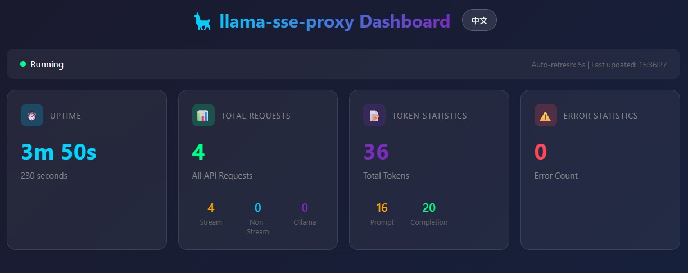

# llama-sse-proxy

**[中文](#中文)** · **[English](#english)**

---

## 中文

### 是什么？

本代理专为 **OpenClaw** 解决上下文用量追踪问题而开发。OpenClaw 需要从流式响应中获取 `usage` 字段来追踪上下文 token 消耗，从而判断是否需要压缩上下文（compact）。

然而经过测试：
- ✅ **Ollama** 能正确返回 `usage` 字段，OpenClaw 工作正常
- ❌ **llama.cpp**、**LM Studio**、**vLLM** 全都返回错误或缺失的 `usage` 字段

**后果**：OpenClaw 永远不知道当前的上下文用量状态，永远不会主动压缩上下文，甚至连手动 `/compact` 命令也会失效，最终只能被迫执行 `/new` 来重启会话。

本代理就是为解决这个问题而生——它将这些后端的响应转换为 Ollama 兼容的格式，确保 OpenClaw 能正确获取上下文用量数据。

**重要说明**：本代理只是一个临时的折中方案。理想情况下，要么由 llama.cpp、LM Studio、vLLM 等后端规范 `usage` 字段的返回，要么由 OpenClaw 提供更灵活的 token 统计方式，从源头上解决这个兼容性问题。

```
OpenClaw → llama-sse-proxy :8081 → llama.cpp / LM Studio / vLLM :8080
```

### 前因后果

#### 问题描述

OpenClaw 的上下文管理机制依赖流式响应中的 `usage` 字段：

```json
{
  "prompt_tokens": 1234,
  "completion_tokens": 567,
  "total_tokens": 1801
}
```

通过 `total_tokens` 累计，OpenClaw 判断是否达到压缩阈值（如 80% contextWindow），触发自动上下文压缩。

#### 问题根源

经过测试，主流本地推理后端的问题：

1. **llama.cpp**：`usage` 字段缺失，只有 `timings` 对象
2. **LM Studio**：`usage.prompt_tokens` 和 `usage.completion_tokens` 经常为 0
3. **vLLM**：某些版本的 `usage` 数据不准确或缺失

只有 **Ollama** 能够稳定返回正确的 `usage` 字段。

#### 最终后果

- OpenClaw 的 `sessions.json` 中 `totalTokens` 永远停留在 0 或错误值
- 上下文用量监控失效
- `/compact` 命令无效（因为系统认为上下文还很空）
- 唯一办法：手动 `/new` 重启会话，丢失所有历史上下文

### 解决方案

本代理通过以下方式解决问题：

1. **透明转发**：拦截所有请求，转发给后端（llama.cpp / LM Studio / vLLM）
2. **注入 usage**：从后端响应中提取 token 信息（如 llama.cpp 的 `timings.prompt_n`、`timings.predicted_n`）
3. **Ollama 兼容格式**：在 `data: [DONE]` 之前注入标准格式的 `usage` chunk
4. **兜底机制**：如果后端未返回 token 数据（如连接中断），根据生成的文本长度估算 token 数

### 依赖

- Python 3.8+（仅使用标准库，无需 pip install）
- `curl` 在 PATH 中（Windows 10/11 自带；Linux/macOS 通常预装）

> ⚠️ **版本兼容**：本代理仅兼容 **OpenClaw 2026.3.31**。OpenClaw 2026.4.x 对 token 计算逻辑进行了重大修改（`deriveSessionTotalTokens` 改为返回当前请求的 prompt tokens 而非 session 累计值），导致上下文压缩功能失效。
>
> 回退命令：`npm install -g openclaw@2026.3.31`

### 快速启动

双击 `start.bat` 即可运行（或 `./start.sh`）。

> ⚠️ 首次使用前，先复制 `config.bat.example` 为 `config.bat`，填入你的 Python 路径、后端地址等。

### Web 监控面板

代理启动后，访问 `http://localhost:8081/stats` 查看实时统计：



- **双语支持**：点击右上角切换中文/English
- **实时刷新**：数据每 5 秒自动更新
- **运行状态**：显示运行时间、请求统计、Token 用量、错误计数

### 开机启动

**Windows（用户级，无需管理员）：**
```powershell
# 首次：先配置 config.bat
.\setup_startup.ps1   # 注册开机启动
.\unregister_task.ps1 # 取消开机启动
```

注册后每次登录自动后台启动，窗口完全隐藏。

### 参数说明

| 参数 | 默认值 | 说明 |
|---|---|---|
| `--config` | _(无)_ | JSON 配置文件路径 |
| `--backend` | `http://localhost:8080` | 后端地址（llama.cpp / LM Studio / vLLM） |
| `--port` | `8081` | 代理监听端口 |
| `--log-file` | _(仅输出到 stdout)_ | 可选，指定日志文件路径 |
| `--ollama-model` | _(无)_ | 启用 Ollama API 兼容模式 |
| `--timeout` | `1800` | 流式读取超时时间（秒），默认30分钟 |

### 配置文件

除了命令行参数，也可以使用 JSON 配置文件：

```bash
# 使用配置文件启动
python llama_sse_proxy.py --config config.json
```

复制 `config.json.example` 为 `config.json`，按需修改：

```json
{
  "backend": "http://localhost:8080",
  "port": 8081,
  "timeout": 1800,
  "log_file": null,
  "ollama_model": null
}
```

**优先级**：命令行参数 > 配置文件 > 默认值

### 示例：连接远程后端

```bash
python llama_sse_proxy.py --backend http://192.168.1.100:8080 --port 8081
```

### OpenClaw 配置

在 OpenClaw 中将 provider 指向本代理，而不是直接指向后端：

```json
{
  "models": {
    "providers": {
      "llama-cpp": {
        "baseUrl": "http://localhost:8081/v1",
        "api": "openai-completions"
      }
    }
  }
}
```

### 验证是否运行正常

```bash
curl http://localhost:8081/health
# → ok
```

### 工作原理

1. 将所有请求透明转发给后端（llama.cpp / LM Studio / vLLM）
2. 对于流式响应，监听每个 SSE chunk
3. 从后端特定字段提取 token 信息：
   - llama.cpp：`timings.prompt_n`、`timings.predicted_n`
   - 其他后端：对应的 token 字段
4. 在收到 `data: [DONE]` 前，注入 OpenAI/Ollama 格式的 `usage` chunk
5. 如果后端未返回 token 数据（如连接中断、超时），则根据累积的文本长度估算 completion token：`len(累积文本) // 2`
6. 如果连接在 `[DONE]` 收到之前意外关闭，仍会注入估算的 usage 并发送 `[DONE]`
7. 然后正常发送 `data: [DONE]`

### 许可证

MIT

---

## English

### What is it?

This proxy is specifically built to solve the **OpenClaw context usage tracking problem**. OpenClaw requires the `usage` field from streaming responses to track context token consumption and determine when to compress the context (compact).

However, after testing:
- ✅ **Ollama** returns correct `usage` field, OpenClaw works fine
- ❌ **llama.cpp**, **LM Studio**, **vLLM** all return incorrect or missing `usage` fields

**Consequence**: OpenClaw never knows the current context usage state, never triggers auto-compaction, even manual `/compact` command fails, forcing you to use `/new` and lose all context history.

This proxy fixes this problem by converting responses from these backends to an Ollama-compatible format, ensuring OpenClaw can correctly retrieve context usage data.

**Important Note**: This proxy is a temporary workaround. Ideally, either the llama.cpp, LM Studio, and vLLM backends should standardize the `usage` field return, or OpenClaw should provide a more flexible token counting method, solving this compatibility issue at the source.

```
OpenClaw → llama-sse-proxy :8081 → llama.cpp / LM Studio / vLLM :8080
```

### The Problem

#### Background

OpenClaw's context management relies on the `usage` field in streaming responses:

```json
{
  "prompt_tokens": 1234,
  "completion_tokens": 567,
  "total_tokens": 1801
}
```

By accumulating `total_tokens`, OpenClaw determines when to trigger auto-compaction (e.g., at 80% of contextWindow).

#### Root Cause

After testing, mainstream local inference backends have issues:

1. **llama.cpp**: `usage` field missing, only `timings` object available
2. **LM Studio**: `usage.prompt_tokens` and `usage.completion_tokens` often return 0
3. **vLLM**: Some versions have inaccurate or missing `usage` data

Only **Ollama** consistently returns correct `usage` fields.

#### Final Consequence

- OpenClaw's `sessions.json` `totalTokens` stays at 0 or incorrect values
- Context usage monitoring fails
- `/compact` command ineffective (system thinks context is still empty)
- Only solution: manual `/new` to restart session, losing all context history

### Solution

This proxy solves the problem through:

1. **Transparent forwarding**: Intercepts all requests, forwards to backend (llama.cpp / LM Studio / vLLM)
2. **Inject usage**: Extracts token info from backend response (e.g., llama.cpp's `timings.prompt_n`, `timings.predicted_n`)
3. **Ollama-compatible format**: Injects standard `usage` chunk before `data: [DONE]`
4. **Fallback mechanism**: If backend doesn't return token data (e.g., connection interrupted), estimates token count from generated text length

### Requirements

- Python 3.8+ (standard library only, no pip install needed)
- `curl` on PATH (Windows 10/11: built-in; Linux/macOS: pre-installed)

> ⚠️ **Version Compatibility**: This proxy is only compatible with **OpenClaw 2026.3.31**. OpenClaw 2026.4.x changed the token calculation logic in `deriveSessionTotalTokens` — it now returns the current request's prompt tokens instead of the session's cumulative total — which breaks context compaction entirely.
>
> Rollback: `npm install -g openclaw@2026.3.31`

### Quick Start

Double-click `start.bat` (or `./start.sh` on Linux/macOS).

> ⚠️ Before first use: copy `config.bat.example` to `config.bat` and fill in your Python path, backend URL, etc.

### Web Dashboard

Once the proxy is running, visit `http://localhost:8081/stats` for real-time statistics:


- **Bilingual**: Click top-right to switch between Chinese/English
- **Live refresh**: Data updates every 5 seconds
- **Runtime stats**: Uptime, request counts, token usage, error tracking

### Auto-start on Login

**Windows (user-level, no admin required):**
```powershell
.\setup_startup.ps1   # Register auto-start
.\unregister_task.ps1 # Remove auto-start
```

After registration, the proxy starts in the background on every login, fully hidden.

### Options

| Argument | Default | Description |
|---|---|---|
| `--backend` | `http://localhost:8080` | Backend URL (llama.cpp / LM Studio / vLLM) |
| `--port` | `8081` | Port this proxy listens on |
| `--log-file` | _(stdout only)_ | Optional path to write logs to a file |
| `--timeout` | `1800` | Stream read timeout in seconds, default 30 minutes |

### Example: Remote backend

```bash
python llama_sse_proxy.py --backend http://192.168.1.100:8080 --port 8081
```

### OpenClaw Config

Point OpenClaw's provider to the proxy instead of the backend directly:

```json
{
  "models": {
    "providers": {
      "llama-cpp": {
        "baseUrl": "http://localhost:8081/v1",
        "api": "openai-completions"
      }
    }
  }
}
```

### Verify

```bash
curl http://localhost:8081/health
# → ok
```

### How it works

1. Forwards all requests transparently to the backend (llama.cpp / LM Studio / vLLM)
2. For streaming responses, watches each SSE chunk
3. Extracts token info from backend-specific fields:
   - llama.cpp: `timings.prompt_n`, `timings.predicted_n`
   - Other backends: corresponding token fields
4. Before forwarding `data: [DONE]`, injects a `usage` chunk in OpenAI/Ollama format
5. If backend returns no token data (e.g., connection abort, timeout), estimates completion tokens from accumulated text: `len(accumulated_text) // 2`
6. If the connection closes before `data: [DONE]` is received (aborted run), still injects estimated usage and sends `[DONE]`
7. Then sends `data: [DONE]` as normal

### License

MIT
